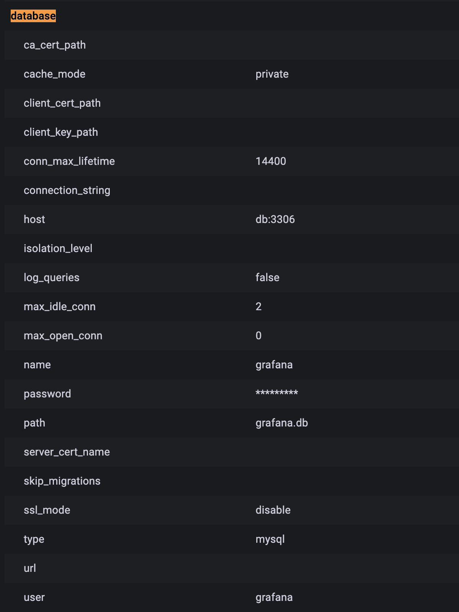

# 도커 컴포즈를 이용하여 Grafana + MySQL 구성

## 1. Grafana 구성하기
### 요구사항
- Grafana의 3000번 포트는 호스트의 3000번 포트와 바인딩
- Grafana의 설정파일인 grafana.ini는 호스트에서 주입하고, 컨테이너상에서는 읽기 전용으로 설정
- Grafana의 로컬 데이터 저장 경로를 확인하여 도커 볼륨 마운트 (컨테이너 종료 후에도 데이터 휘발 X)
- Grafana 플러그인 추가 설치를 위한 환경변수 설정
- 로그 드라이버 옵션을 통해 로그 로테이팅  
    - json-file 로그 드라이버에 대해 로그 양 관리
- Grafana는 기본적으로 SQLite를 DB로 사용하는데, 이번 실습에서는 MySQL 서비스를 다른 컨테이너로 띄워 DBfmf MySQL에 연결

## 2. MySQL 구성하기
### 요구사항 
- grafana.ini를 통해 db 설정을 sqlite에서 MySQL로 변경
- MySQL 컨테이너를 docker-compose에 db 서비스로 추가
- grafana 서비스가 db 서비스를 database로 연결하도록 구성
- MySQL의 로컬 데이터 저장 경로를 확인하여 도커 볼륨 마운트

## grafana-only 디렉토리
grafana 서비스만 구성된 디렉토리
```sh
$ cd grafana-only
$ docker-compose up -d

# 포트 바인딩 된 포트로 응답값 확인
$ curl localhost:3000

# docker-compose 서비스 멈추기 (볼륨도 함께 삭제)
$ docker compose down -v
```

## grafana-mysql 디렉토리
MySQL 서비스를 띄운 후 해당 컨테이너를 grafana의 db로 사용하는 디렉토리
```sh
$ cd grafana-mysql
$ docker-compose up -d

# 웹 브라우저에서 localhost:3000으로 접근
# id = admin / pwd = admin 으로 로그인!
# server admin 탭의 settings에서 database 정보를 보면 host가 db:3306으로 잘 설정되어있음을 확인 가능

# docker-compose 서비스 멈추기
$ docker compose down

# 볼륨이 삭제되지 않은 상태에서 다시 docker-compose up을 하면 이전에 작업했던 데이터들이 남아있음을 확인할 수 있음 
# e.g. user를 grafana ui에서 추가한 후 도커를 내렸다가 (볼륨 삭제는 X) 다시 올리면 만들었던 user로 로그인 가능.
```

{: width="70%"}