# 도커 이미지

## 이미지 저장소
도커의 기본 중앙 이미지 저장소는 [도커 허브(Docker Hub)](https://hub.docker.com/)이며, 도커허브에서 이미지를 내려받음  
도커 허브에서 이미지를 내려받는 시점: `docker create`, `docker run`, `docker pull` 명령어가 수행될 때 로컬에 내려받아 둔 이미지가 없는 경우   

도커 허브에서 비공개(private) 저장소를 사용하려면 요금을 지불해야함  
도커 허브에서 사설 저장소를 사용하는 것에 대한 대한으로 도커 이미지 저장소를 직접 구축해 비공개로 사용할 수 있음 (도커 사설 레지스트리)

도커 허브에 있는 이미지 목록을 확인하기 위해 `docker search [이미지명]`의 명령어를 사용할 수 있음  
```sh
$ docker search ubuntu
```
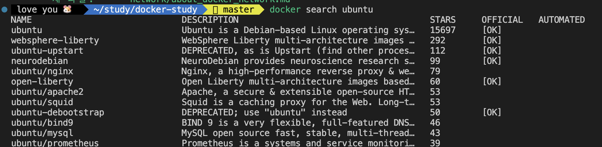

이미지명을 별 다른 접두어 없이 사용하면 기본값인 docker.io로 설정되어 도커허브에서 이미지 목록을 search함  


## 이미지 생성 및 삭제
이미지를 사용할 때는 도커 레지스트리에 등록된 이미지를 내려받아 사용하는 방법도 있으나 특정 개발 환경을 직접 구축해야 할 때도 있음  
이런 경우 컨테이너 내에 원하는 환경을 다 세팅한 후에 이미지화하면 원하는 이미지를 생성할 수 있음  

### 컨테이너를 이미지로 만드는 방법
```sh
$ docker commit [OPTIONS] CONTAINER [REPOSITORY[:TAG]]
```

```sh
$ docker run -ti --name commit_test_container ubuntu:20.04

# 컨테이너 내부로 진입
$ echo "test file content" >> test_file.txt

# ctrl + p + q로 컨테이너를 종료하지 않고 쉘 나오기

# 로컬 터미널
$ docker commit commit_test_container commit_test_image:1.0

# 이미지 목록에 commit_test_image:1.0 있는 지 확인
$ docker images

# 만들어진 이미지에 test_file.txt 파일 있나 확인
$ docker run -ti --name check_commit_test commit_test_image:1.0
$ ls
```
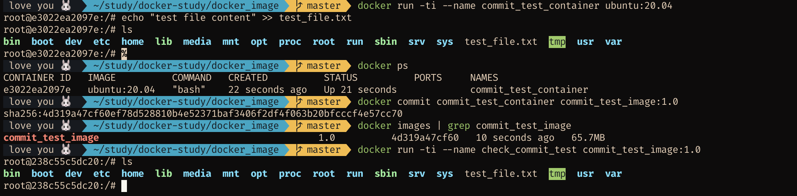


### 이미지 구조
이미지의 구조를 알아보기 위해 사용할 수 있는 명령어
```sh
$ docker inspect [이미지명]:[이미지태그]
```
*(이미지뿐 아니라 볼륨, 네트워크의 상세정보 확인 시에도 `inspect`명령어 사용 가능. 단, 이미지에서 찾는 것이 디폴트이므로 `--type volume` 식으로 타입을 명시해주면 좋음)*
`ubuntu:20.04` 이미지와 이 이미지를 이용해 앞에서 생성한 `commit_test_image:1.0` 이미지의 inspect 결과에서 RootFS.Layers 부분을 확인하면 아래와 같음
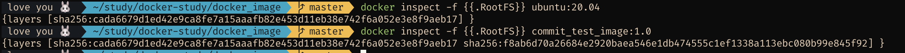
`commit_test_image:1.0` 이미지의 레이어는 `ubuntu:20.04` 이미지의 레이어 위에 레이어 하나가 더 생긴 것을 확인할 수 있음

컨테이너 커밋 시에 겹치는 이미지 레이어까지 새로 저장하는 것은 아니고 새로 생긴 레이어만 추가 저장됨 

커밋 이력은 `docker history` 명령어를 통해 가능
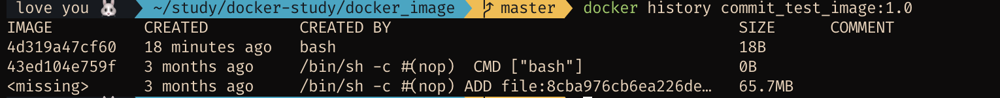


### 이미지 삭제
이미지 삭제 명령어는 `docker rmi`
```sh
$ docker rmi commit_test_image:1.0
```

참고로, 이미지를 사용중인 컨테이너가 있다면 삭제가 불가능하므로 컨테이너 중지/제거 후에 시도해야함  
```sh
# 컨테이너 stop
$ docker stop [ContainerID or ContainerName]
$ docker rm [ContainerID or ContainerName]
```

컨테이너가 사용 중인 이미지를 -f 옵션을 주어 삭제하면 이미지의 이름이 none으로 변경되며 dangling된 이미지가 됨  
이런 이미지를 확인하려면 `-f` 옵션으로 `dangling=true` 필터링을 걸어 볼 수 있음
```sh
$ docker images -f dangling=true

# dangling된 이미지만 골라서 삭제할 때
$ docker rmi $(docker images -f dangling=true -q)

# 사용하지 않는 이미지 삭제
$ docker image prune
```

이미지 삭제 시에 Untagged로 결과가 나오는 경우는 이미지 파일을 실제로 삭제하지는 않고 레이어에 부여된 이름만 삭제한다는 의미임   
(해당 이미지를 사용하는 하위 이미지가 있을 때 주로 Untagged로 동작)
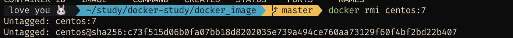
이미지 삭제 시에 Deleted로 결과가 나오면 이미지 레이어가 실제로 삭제되었다는 의미임  
참고로 실제로 이미지 레이어가 삭제되려면 삭제되는 이미지의 부모 이미지가 존재하지 않아야함  
부모 이미지가 존재하면 부모 이미지 내에 포함되는 이미지 레이어들은 삭제 대상에서 제외됨
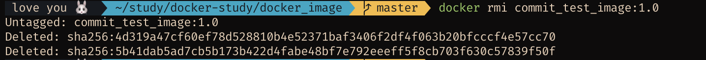

### 이미지 추출, 로드
이미지 추출 명령어
```sh
# ubuntu_20_04.tar라는 파일명으로 ubuntu:20.04 이미지를 저장
$ docker save -o ubuntu_20_04.tar ubuntu:20.04
```
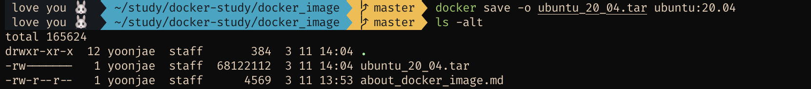

이미지 로드 명령어 (추출된 이미지를 다시 이미지로 되돌림)
```sh
$ docker load -i ubunut_20_04.tar
```
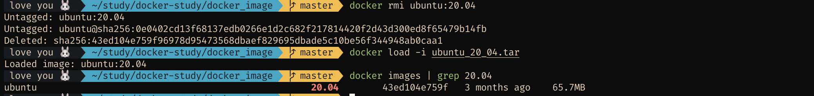

**추가)** 컨테이너를 commit 대신 이미지화할 수 있는 명령어 - export & import   
차이점은 컨테이너를 commit하여 만든 이미지의 경우 컨테이너에 생긴 변경사항 뿐만 아니라 그 외의 부가정보(컨테이너 생성 시 설정된 detached 모드, 컨테이너 커맨드 등)도 함께 저장되는데 export 명령어를 통해 이미지를 파일로 추출하면 해당 사항들은 저장되지 않음
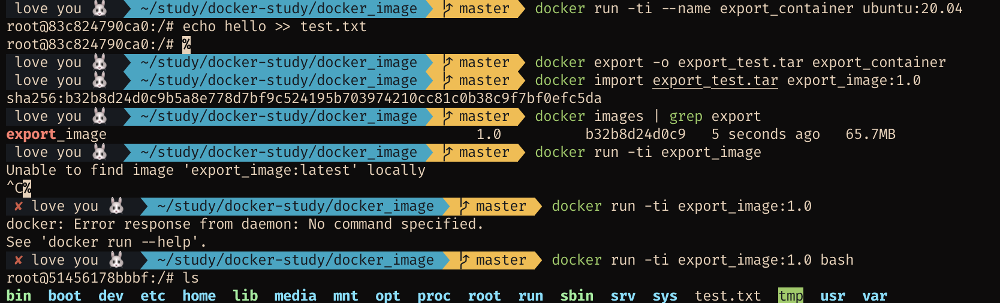

*이미지를 단일 파일로 저장하면 겹치는 레이어도 따로 저장되어 용량상의 이점을 누릴 수없으므로 효율적이지 않다는 점 기억해두기*

## 이미지 배포
이미지를 배포하기 위해 다른 서버로 옮길 때 save/export 등의 방법으로 이미지를 옮겨도 되지만 이미자 파일의 크기가 크거나 도커 엔진의 수가 많으면 이미지를 파일로 배포하기 어려움  
시도해볼 수 있는 다른 방법으로는 아래 방법들이 있음  

1. 도커 허브 이미지 저장소 이요하기  
  - 원하는 이미지 push
  - 배포할 서버에서 이미지 pull
  - 단, 결제하지 않으면 사용할 수 있는 비공개 저장소 개수에 제한이 있음 (공개 저장소는 무료 이용 가능)  
2. 도커 사설 레지스트리 사용
  - 사용자가 직접 이미지 저장소 만들기
  - 직접 서버 및 저장 공간 관리해야함
  - 회사 내부망과 같은 곳에서 사용하면 좋음  

### [도커 허브](https://hub.docker.com/)
도커 허브 페이지에서 Create Repository 버튼을 통해 repository 생성 가능  
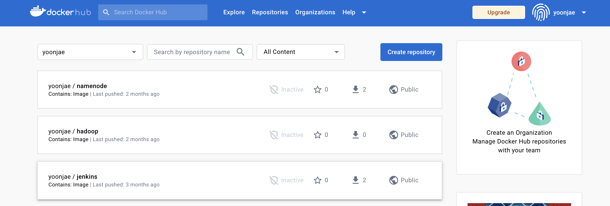
public 레지스트리 이미지는 아무나 docke pull 받을 수 있음  
private 레지스트리 이미지는 접근 권한이 있어야 저장소 사용 가능  
도커 레지스트리 이름이 `test_image`라고 치면 해당 레지스트리 내에는 `test_image`라는 이름을 갖는 이미지들이 업로드됨

저장소에 이미지를 업로드하기 위해서는 `저장소이름/레지스트리이름:태그` 형태로 이미지의 이름이 설정되어있어야함
```sh
# 업로드 불가
$ docker push test_image:1.0.0

# 업로드 가능
$ docker push yoonjae/test_image:1.0.0

# 이미지 이름 변경 방법 (기존 이름이 사라지는 것은 아니고 새로운 이름의 동일 이미지가 하나 더 생성되는 것)
$ docker tag original_name:1.0.0 yoonjae/new_image_name:1.0.0
```

참고로 업로드를 위해서는 도커허브에 로그인이 되어있어야 하므로 아래 명령어를 통해 터미널에서 로그인 필요
```sh
# 로그인
$ docker login

# 로그아웃
$ docker logout
```

**도커 허브 추가 사항**  
- 조직 / 팀 생성 가능 (유료)
- webhook 추가 가능
  - 저장소에 이미지가 push 됐을 때 특정 URL로 http 요청을 전송하도록 설정하는 기능


### 도커 사설 레지스트리  
사설 레지스트리 사용 시 개인 서버에 이미지 저장 가능  
사설 레지스트리를 제공해주는 도커 이미지를 pull 받아 컨테이너로 띄워서 사용 가능  

```sh
$ docker run -d --name myregistry \
  -p 5000:5000 \
  --restart=always \
  registry:2.6
```

>참고) restart option 
>- always: 컨테이너 정지 시마다 다시 시작 (도커 호스트나 엔진 다시 시작하면 컨테이너도 재시작됨)
>- on-failure: on-failure:5로 설정 시에는 종료 코드가 0(정상 종료)이 아닐 시에는 재시작을 5번까지 시도
>- unless-stopped: 컨테이너를 stop 명령어로 정지한 경우 도커 호스트나 엔진을 재시작해도 컨테이너가 시작되지 않음


위 명령어로 컨테이너가 떴다면 레지스트리로 curl 요청을 보낼 수 있음
```sh
$ curl localhost:5000/v2
```

**사설 레지스트리에 이미지 Push 하기**
```sh
# 레지스트리 push를 위해 도커 이미지 이름 변경
$ docker tag export_image:1.0 localhost:5000/export_image:1.0   # localhost
$ docker tag export_image:1.0 192.168.xx.xxx:5000/export_image:1.0  # local ip 주소
# push
$ docker push localhost:5000/export_image:1.0 # push 성공
$ docker push 192.168.xx.xxx:5000/export_image:1.0  # push 실패
```
위의 경우 두번째는 `Get "https://192.168.xx.xx:5000/v2/": http: server gave HTTP response to HTTPS client` 메세지와 함께 push 실패  
그 이유는 도커 데몬은 https를 사용하지 않은 레지스트리 컨테이너에 접근하지 못하도록 설정되어 있기 때문임  
따라서 docker desktop -> 우측 상단 설정 -> docker engine -> json 파일에 아래 내용 추가
```json
{
  "builder": {
    "gc": {
      "defaultKeepStorage": "20GB",
      "enabled": true
    }
  },
  "experimental": false,
  "features": {
    "buildkit": true
  },
  "insecure-registries": ["192.168.xx.xx:5000"]
}
```

**사설 레지스트리에 이미지 Pull 받기**
```sh
$ docker pull 192.168.xx.xx:5000/export_image:1.0
```

**사설 레지스트리에서 사용 가능한 API**
1. 이미지 목록 확인하기
  - ```sh
    $ curl localhost:5000/v2/_catalog
    ```
  - 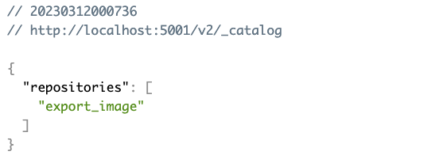
2. 이미지 태그 리스트까지 확인하기
  - ```sh
    $ curl localhost:5000/v2/export_image/tags/list
    ```
  - 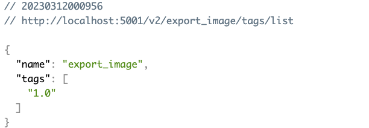
3. 이미지 상세 정보 확인하기
  - ```sh
    $ curl -i --header "Accept: application/vnd.docker.distribution.manifest.v2+json" \
    localhost:5000/v2/export_image/manifests/1.0
    ```  
  - manifest = 레지스트리 컨테이너에 저장된 이미지 정보의 묶음
  - 도커 이미지
    1. 이미지 정보 저장 매니페스트
    2. 실제 이미지에 레이어 파일을 저장하는 바이너리 파일
4. 이미지 삭제하기
  - 이미지를 삭제하려면 이미지 매니페스트 레이어와 레이어 파일을 따로 삭제해야함  
  - 매니페스트 삭제 URL
    > DELETE /v2/(이미지명)/manifests/(매니패스트 다이제스트)
    ```sh
    $ curl --header "Accept: application/vnd.docker.distribution.manifest.v2+json" \
      -X DELETE -v \
      192.168.xx.xx:5000/v2/[image_name]/manifests/sha256:a9d790c06e...
    ```
  - 레이어 파일 삭제 URL
    > DELETE /v2/(이미지명)/blobs/(레이어 다이제스트)
    ```sh
    $ curl -X DELETE \
      -i 192.168.xx.xx:5000/v2/[image_name]/blobs/sha:e9790d90c0abe0f9...
    ```
  - 이미지를 삭제하려면 사설 레지스트리리 컨테이너를 실행할 때 `REGISTRY_STORAGE_DELETE_ENABLED` 환경변수를 true로 설정해야함
    ```sh
    $ docker run -d --name registry_delete_enabled \
      -p 5000:5000 \
      --restart=always \
      -e REGISTRY_STORAGE_DELETE_ENABLED=true \
      registry:2.6
    ```

**사설 레지스트리 옵션**
위에서 이미지 삭제를 위해 `REGISTRY_STORAGE_DELETE_ENABLED` 환경변수를 설정한 것처럼 여러 옵션을 설정하기 위해 추가적인 환경변수를 설정할 수 있음  
환경변수를 통해 이미지 삭제, 스토리지 백엔드, 이미지 레이어 파일 저장 디렉터리, 웹훅 설정 등을 할 수 있음  
```sh
$ docker run -d -p 5000:5000 --name registry_delete_enabled \
  --restart=always \
  -e REGISTRY_STORAGE_DELETE_ENABLED=true \
  -e REGISTRY_STORAGE_FILESYSTEM_ROOTDIRECTORY=/var/lib/mydocker \
  ...
  registry:2.6
```

환경변수로 일일히 설정하지 않고 yml 파일을 정의해 레지스트리 컨테이너의 환경변수를 설정할 수도 있음  
yml 파일을 설정하지 않았을 때 기본 yml 파일은 아래와 같음  
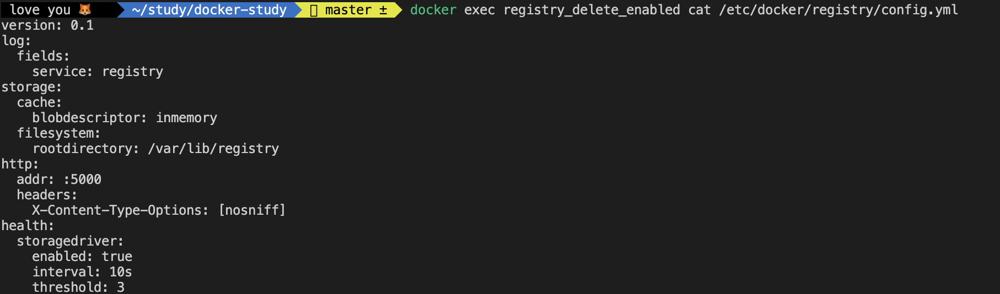

직접 작성한 yml파일 적용
```yml
# config.yml

version: 0.1
log:
  level: info     # 로그 출력 레벨 info로 설정
storage:
  filesystem:
    rootdirectory: /registry_data   # 이미지 파일이 저장되는 디레터리 지정
  delete:
    enabled: true
http:
  addr: 0.0.0.0:5000    # 레지스트리 서비스를 바인딩할 주소
```

위 config파일을 적용한 container 실행
```
$ docker run -d -p 5001:5000 --name yml_registry \
  --restart=always \
  -v $(pwd)/config.yml:/etc/docker/registry/config.yml \
  registry:2.6
```

