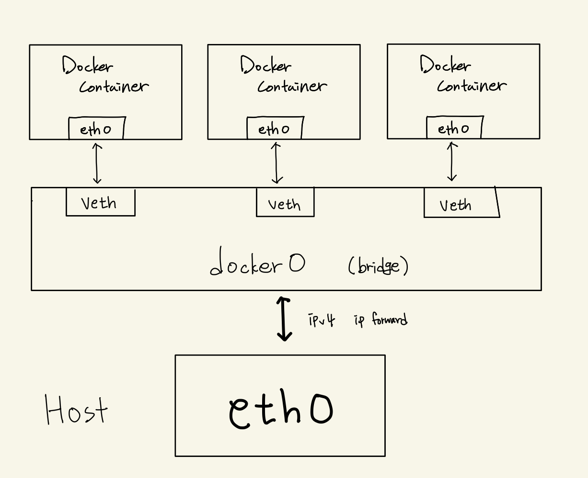

# 도커 네트워크

## 구조  
도커는 컨테이너에 내부 IP를 순차적으로 할당하며 이 IP는 컨테이너를 재시작할 때마다 변경될 수 있음  
내부 IP는 도커가 설치된 호스트의 내부 망에서만 사용 가능하므로 외부와 연결  X  

도커의 네트워크 구성은 컨테이너를 시작할 때 호스트에 `veth`라는 네트워크 인터페이스를 생성하여 이뤄짐  
> `veth`: 각 컨테이너에 외부와의 네트워크를 제공하기 위한 가상 네트워크 인터페이스. 호스트에 생성되며 이름이 veth~~로 시작됨

-> 도커 컨테이너를 실행하고 ifconfig를 확인해보면 실행 중인 컨테이너 수만큼 veth로 시작하는 인터페이스가 생성됨  

**eth0**  
- 공인 IP or 내부 IP가 할당되어 실제로 외부와 통신할 수 있는 호스트의 네트워크 인터페이스 
- veth 인터페이스는 각 컨테이너의 eth0과 연결됨



## 도커 네트워크 종류
도커 네트워크 목록 확인
```sh
$ docker network ls
```
기본으로 bridge, host, none이 생성되어 있음  

도커 네트워크 상세정보 확인
```sh
$ docker network inspect bridge
```

### bridge
컨테이너 생성 시 자동으로 연결되는 docker0 브리지를 활용하도록 설정되어있음  
이 네트워크는 172.17.0.x 대의 IP 대역을 컨테이너에 순차적으로 할당함.

bridge 네트워크를 생성하고 사용하면 docker0 브리지 대신 생성된 사용자 정의 브리지에 각 컨테이너를 연결  
컨테이너는 브리지를 통해 외부와 통신  

브리지 네트워크 생성 명령어
```sh
$ docker network create --driver bridge mybridge
```

위의 네트워크 브리지를 사용하는 컨테이너 실행
```sh
$ docker run -ti --name mybridge_container --net mybridge ubuntu:20.04
```

유동적으로 네트워크 연결/연결해제 가능
```sh
$ docker network disconnect mybridge mybridge_container # 연결 해제
$ docker network connect mybridge mybridge_container    # 재연결
```

네트워크 생성 시 서브넷, 게이트웨이, IP 할당 범위 등으 ㄹ설정하기
```sh
$ docker network create --driver=bridge \
  --subnet=172.72.0.0/16 \
  --ip-range=172.72.0.0/24 \
  --gateway=172.72.0.1 \
  my_custom_network
```

### host
호스트의 네트워크 환경을 그대로 쓰고자 할 떄 사용 가능 
호스트 드라이버 네트워크는 별도로 생성할 필요 없이 기존의 host라는 이름의 네트워크를 사용  

```sh
$ docker run -ti --name host_network_container --net host ubuntu:20.04
```
컨테이너의 호스트 이름도 무작위 16진수가 아닌 도커 엔진이 설치된 호스트 머신의 호스트 이름으로 설정됨  

별도의 포트포워딩 없이 바로 컨테이너에서 서비스 가능  
- e.g. 아파치 웹 서버를 호스트 모드를 네트워크로 쓰는 컨테이너에서 구동하면 <호스트의 IP>:80으로 바로 접근 가능

### none
아무런 네트워크를 쓰지 않는 것을 의미
```sh
$ docker run -ti --name none_network_container --net none ubuntu:20.04
```
해당 컨테이너 내에서 `ifconfig`로 네트워크를 조회하면 로컬호스트인 `lo`이외에는 존재하지 않음

### container
다른 컨테이너의 네임스페이스 환경을 공유 가능  
공유되는 속성으로는 내부 IP, 네트워크 인터페이스의 MAC 주소 등이 있음ㄴ   
```sh
$ docker run -tid --name container_network_container1 ubuntu:20.04
$ docker run -tid --name container_network_container2 --net container_network_container1 ubuntu:20.04
```

다른 컨테이너의 네트워크 환경을 공유받으면 내부 IP를 새로 할당받지 않으며 호스트에 veth로 시작하는 가상 네트워크 인터페이스도 생성되지 않음  
`container_network_container2`의 네트워크 관련 사항은 전부 `container_network_container1`과 같게 설정됨  

### 브리지 네트워크와 --net-alais
브리지 타입의 네트워크와 --net-alias 옵션을 함께 쓰면 특정 호스트 이름으로 컨테이너 여러 개에 접근 가능  
```sh
$ docker run -tid --name network_alias_container1 \
  --net mybridge \
  --net-alias test_server ubuntu:20.04

$ docker run -tid --name network_alias_container2 \
  --net mybridge \
  --net-alias test_server ubuntu:20.04

$ docker run -tid --name network_alias_container3 \
  --net mybridge \
  --net-alias test_server ubuntu:20.04
```

위의 컨테이너 network_alias_container1,2,3 은 각각 다른 ip 주소를 가짐 (docker inspect로 확인 가능)  

저 3개의 컨테이너에 접근 가능하도록 mybridge 네트워크를 사용하는 컨테이너를 띄운 후 아래 ping 명령어를 날려봄
```sh
$ ping -c 1 test_server
```
결과로 매번 다른 ip 주소를 갖는 서버에서 응답이 옴 = 매번 다른 컨테이너로 응답이 감  

응답을 보낼 컨테이너를 결정하는 것은 라운드 로빈 방식.  
도커 엔진에 내장된 DNS가 `test_server`라는 호스트 이름을 `--net-alias` 옵션으로 `test_server`를 설정한 컨테이너로 변환하기 때문  

도커의 DNS는 호스트 이름으로 유동적인 컨테이너를 찾을 때 사용됨  
`--link`옵션도 이와 비슷하게 쓰였는데, `--link` 옵션을 쓰는 경우는 디폴트 브리지 네트워크를 사용하는 컨테이너 DNS라는 점이 다름  

> 참고로 dig라는 DNS 도메인에 대응하는 IP를 조회할 떄 쓰는 도구를 사용하면 이를 확인할 수 있음  
컨테이너 내부에서 아래 명령어 수행해 확인
```sh
$ apt-get update
$ apt-get install dnsutils
$ dig test_server
```
  